# Microservices App Deployment on AWS EKS
This is a guide that provides a step-by-step instructions for deploying a micro-service application on AWS Elastic Kubernetes Service (ESK). In this case, my project name is **Sock-Shop**

## Projects Requirements
- Cloud Provider Account - AWS prefered
- AWS CLI
- Terraform
- Kubectl
- Helm
- Grafana
- Micro-service Application - Sock Shop
- CI/CD - Github Actions

## Project Structure
## Project Objective
This project is about deploying a microservices-based application using automated tools to ensure quick, reliable, and secure deployment on Kubernetes. By focusing on Infrastructure as Code, you'll create a reproducible and maintainable deployment process that leverages modern DevOps practices and tools.

### Steps to Deploy the Microservice Application
Ensure you have the following installed on your local machine:
- Git
- AWS CLI
- Helm
- Terraform

Using Terraform as an Infrastructure as a Code (IaaC) tool, create a `main.yml` file  to contain the deployment of your infrastructure in AWS. 

- Confuigure your terminal for AWS with `AWS configure`  and complete the prompt as required
- Initialize terraform in the same directory of your **main.tf**  with the command `terraform init`
- To preview the resources to be deployed, run `terraform plan`
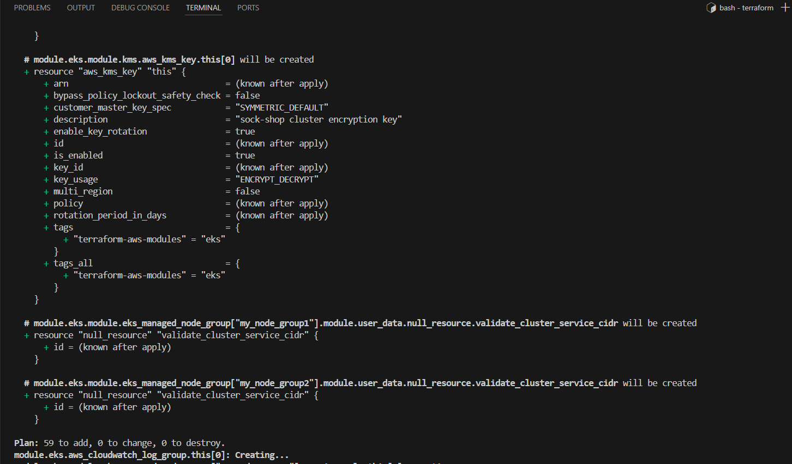
- Run `terraform apply` to provision the resource on AWS.

- Go to your AWS console to confirm the provisioned resource as shown in the image below
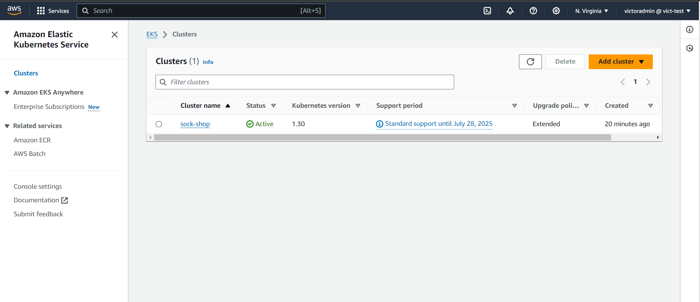

- Configure kubectl to use the new EKS cluster.
`aws eks update-kubeconfig --region us-east-1 --name sock-shop`
- `kubectl apply -f <yml-file-create-app-deployment>`
  
    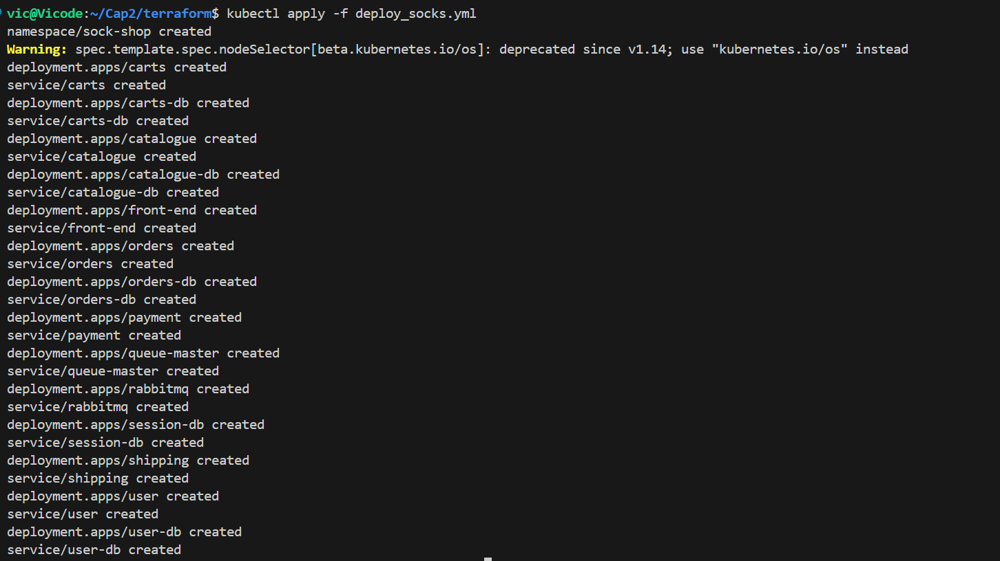
- Check your AWS console to view deployed app

  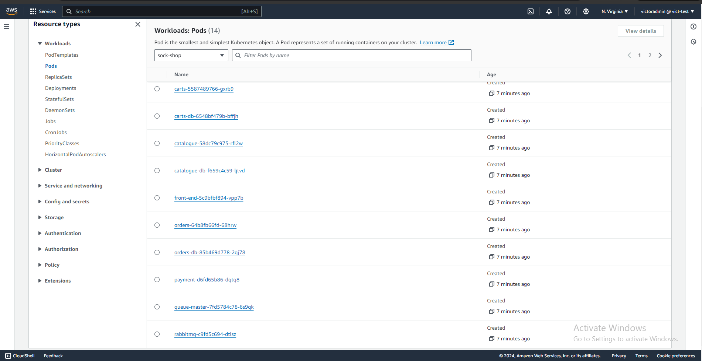
  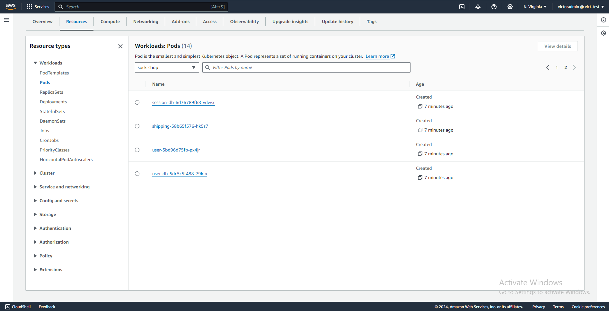

- Configure your current directory to make your namespace default 
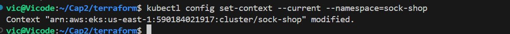

- To see all running deployment, pods and services, run `kubectl get all`
  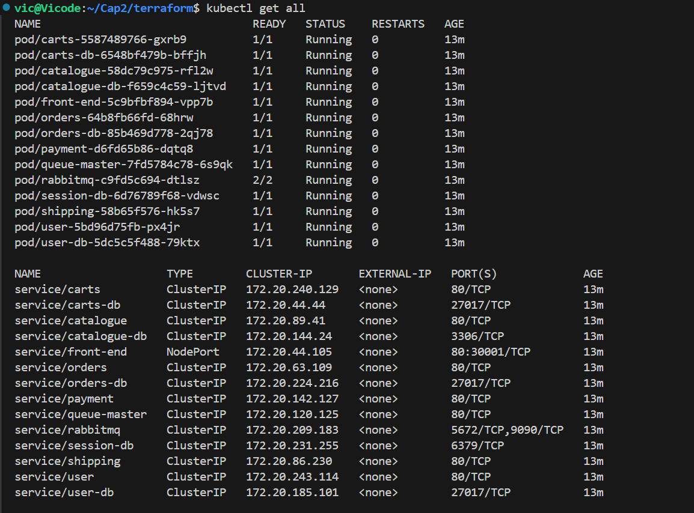
  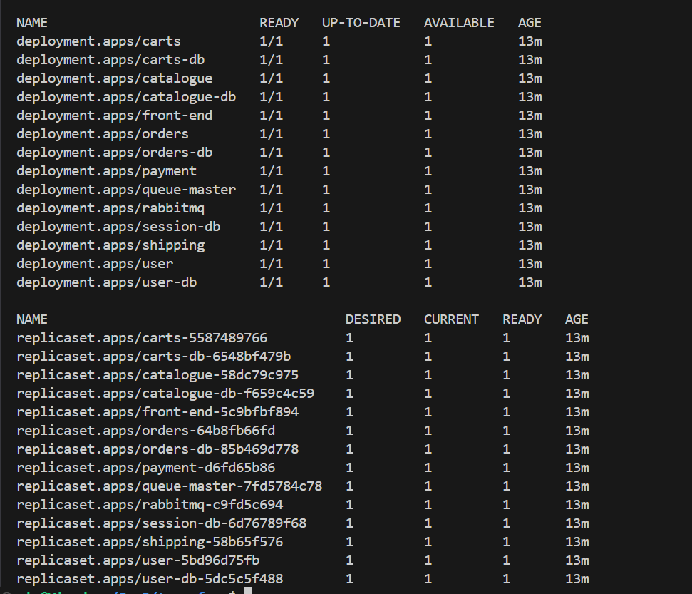

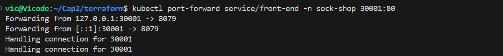
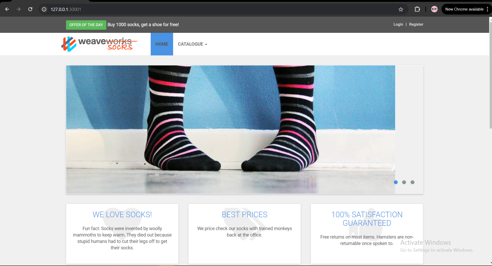

<!-- 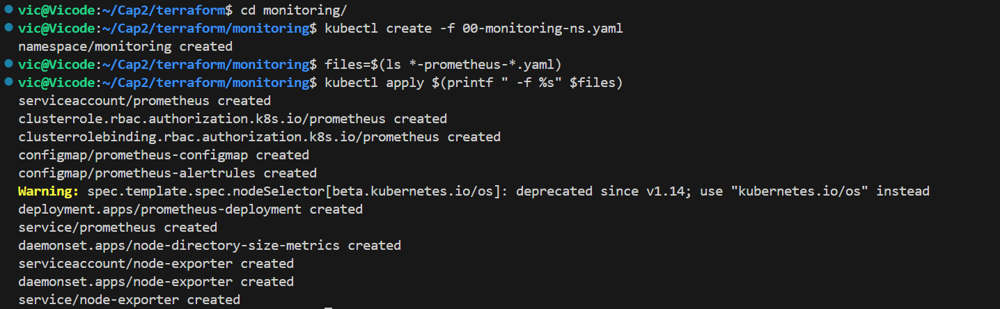 -->
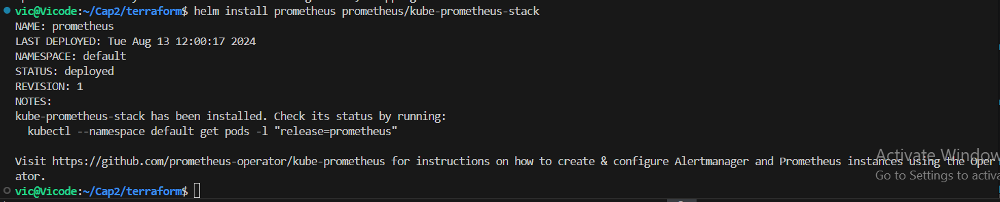
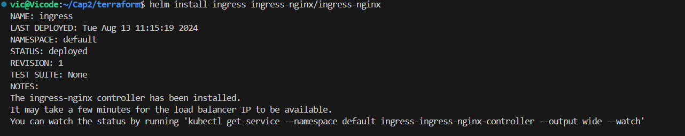
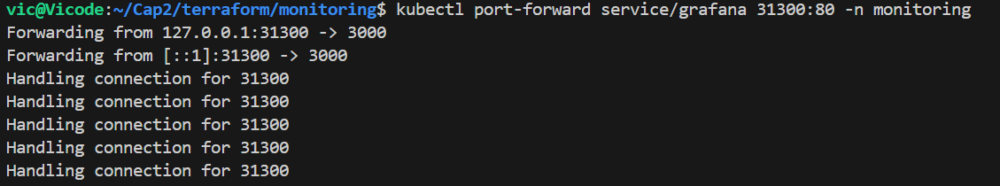

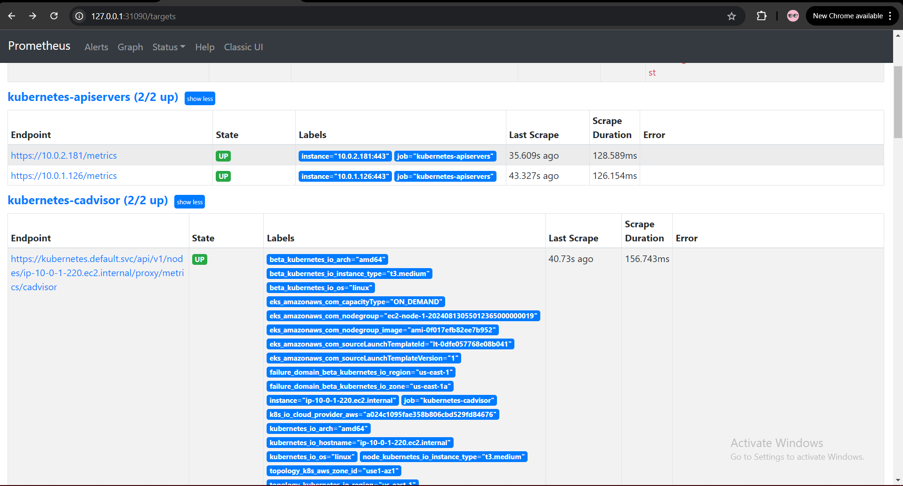
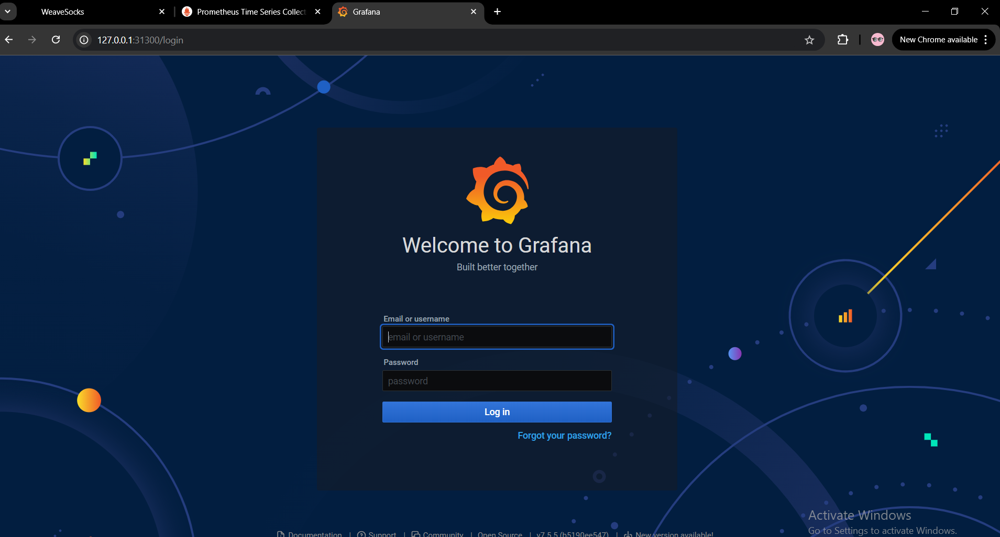
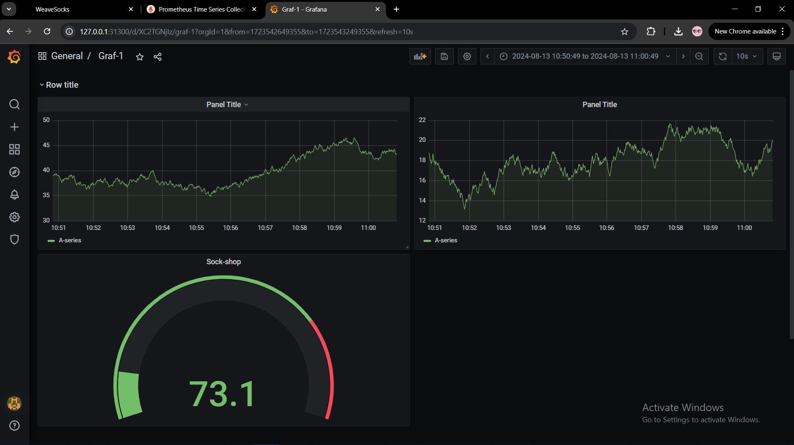

- Apply config to export specified port in ingress
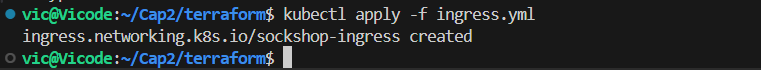